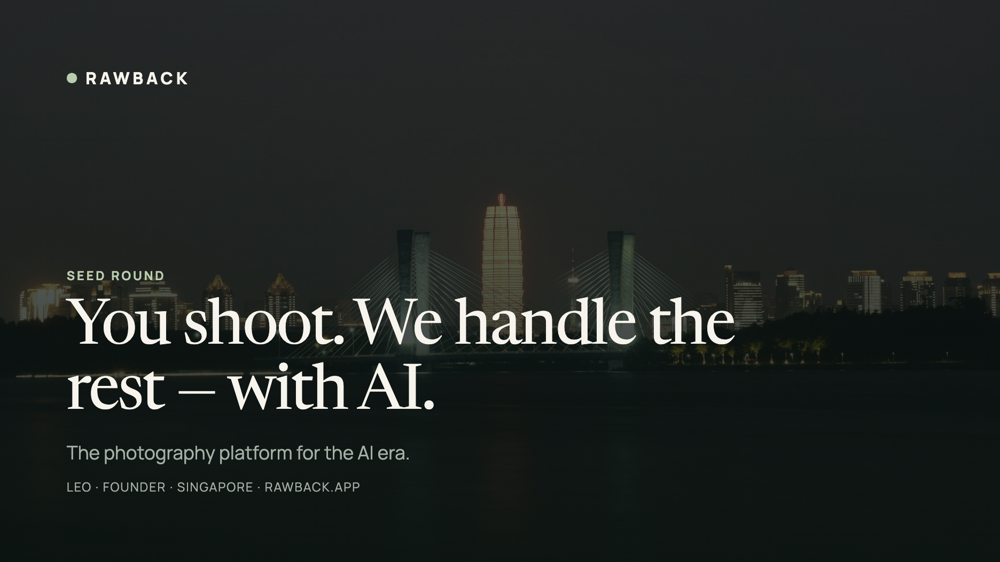
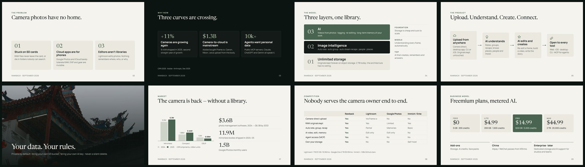

# Rawback — Investor Relations

**English** · [中文](README.zh-CN.md)

> **You shoot. We handle the rest — with AI.**
> [Rawback](https://rawback.app) is the photography platform for the AI era: a permanent home for camera photos, with AI that understands, edits and remembers them.

## The deck

| | English | 中文 |
|---|---|---|
| PDF | [Rawback-Investor-Deck-EN.pdf](Rawback-Investor-Deck-EN.pdf) | [Rawback-Investor-Deck-ZH.pdf](Rawback-Investor-Deck-ZH.pdf) |
| Web | [en/index.html](en/index.html) | [zh/index.html](zh/index.html) |

Seed round · 13 slides · September 2026. The PDFs open right here on GitHub. The web decks are self-contained HTML — download and open in any browser, scroll to page through.

## Rawback in one minute

**The problem — camera photos have no home.** RAW files stay stuck on SD cards or die in folders nobody can search. Cloud photo apps are built for phones: they barely tolerate RAW, and EXIF and gear are invisible. Editors like Lightroom edit photos, but nothing remembers where, who, or why.

**Why now — three curves are crossing.** Cameras are growing again (9.44M shipped in 2025, +11%, second straight year of growth). Camera-to-cloud is mainstream — Adobe bought Frame.io, and Canon, Nikon and Leica upload from the body. And AI agents want personal data: 10k+ public MCP servers, with Claude, ChatGPT and Gemini all speaking it.

**The model — three layers, one library.**

| | Layer | What it does |
|---|---|---|
| 03 | **AI** | Videos from photos · tagging · re-editing · long-term memory of your work |
| 02 | **Image intelligence** | Auto rate · auto group · auto dream recaps · people · places |
| 01 | **Unlimited storage** | Originals kept forever on object storage — 2 TB today, no architectural ceiling |

**The product — upload, understand, create, connect.**

- **Upload from anywhere** — camera direct, desktop app, CLI or iOS. Originals kept untouched.
- **AI understands** — rates, groups and recaps; knows places, people and mood.
- **AI edits and creates** — re-edit a frame, build a video, write the story.
- **Open to every tool** — web, iOS, desktop, CLI, and MCP for agents.

**Your data, your rules.** Private by default · bring your own S3 bucket · bring your own AI key · never a silent delete.

**Business model — freemium plans, metered AI.**

| Free | Lite | Pro | Max |
|---|---|---|---|
| $0 | $4.99/mo | $14.99/mo | $44.99/mo |
| 5 GB · 200 credits | 200 GB · 1,500 credits | 600 GB · 5,000 credits | 2 TB · 20,000 credits |

Plus add-ons (storage, AI credits, face packs), Alipay / WeChat passes for China, and an enterprise tier later.

**Where we are.** The product is finished and live on web, iOS, desktop, CLI and MCP. Payments are live (Stripe, Apple Pay, Alipay, WeChat Pay), in five languages and China-ready. Next: distribution — which is what this round buys.

Market, competition, roadmap and the ask are in the [full deck](Rawback-Investor-Deck-EN.pdf).

## Try it

- **Product** — [rawback.app](https://rawback.app)
- **CLI**, for humans and AI agents — [rawback-app/cli](https://github.com/rawback-app/cli)
- **Homebrew tap** — [rawback-app/homebrew-tap](https://github.com/rawback-app/homebrew-tap)

## In this repo

- `Rawback-Investor-Deck-{EN,ZH}.pdf` — the decks, ready to send.
- `en/`, `zh/` — self-contained HTML decks (open in any browser; print to PDF), plus preview images.
- `src/` — slide sources, one HTML file per slide, plus the deck index (`deck.json`).
- `assets/` — photographs used in the decks, shot by the founder.

## Contact

Leo · Founder · Singapore
[annatar.he@gmail.com](mailto:annatar.he@gmail.com) · [rawback.app](https://rawback.app)
