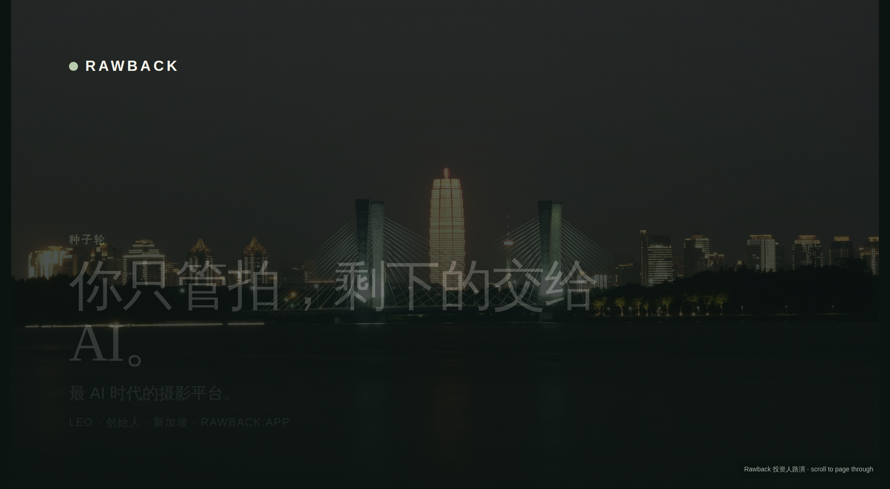
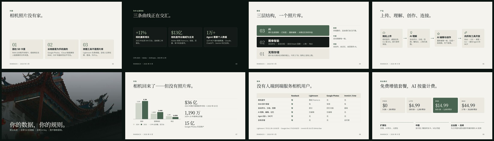

# Rawback — 投资者关系

[English](README.md) · **中文**

> **你只管拍，剩下的交给 AI。**
> [Rawback](https://rawback.app) 是 AI 时代的摄影平台：给相机照片一个永久的家，让 AI 去理解、编辑并记住它们。

## 路演材料

| | English | 中文 |
|---|---|---|
| PDF | [Rawback-Investor-Deck-EN.pdf](Rawback-Investor-Deck-EN.pdf) | [Rawback-Investor-Deck-ZH.pdf](Rawback-Investor-Deck-ZH.pdf) |
| 网页 | [en/index.html](en/index.html) | [zh/index.html](zh/index.html) |

种子轮 · 13 页 · 2026 年 9 月。PDF 可直接在 GitHub 上打开；网页版是单文件 HTML——克隆或下载整个仓库后，用任意浏览器打开 `en/index.html`，滚动即可翻页（请保留同级的 `assets/` 目录，照片和字体从那里加载）。

## 一分钟了解 Rawback

**问题——相机照片没有家。** RAW 从未离开存储卡，或者堆在无人能搜索的文件夹里。云相册是为手机做的：勉强兼容 RAW，EXIF 和器材完全不可见。Lightroom 这类工具负责修图，却没有人记得在哪、是谁、为什么。

**为什么是现在——三条曲线正在交汇。** 相机重新增长（2025 年出货 944 万台，+11%，连续第二年增长）。相机直传云端成为主流——Adobe 收购 Frame.io，佳能、尼康、徕卡均支持机身直传。AI Agent 需要个人数据：公开 MCP 服务器已超 1 万个，Claude、ChatGPT、Gemini 均已支持。

**模型——三层结构，一个照片库。**

| | 层 | 作用 |
|---|---|---|
| 03 | **AI** | 照片生成视频 · 打标签 · 重新编辑 · 长期记忆你的作品 |
| 02 | **图像智能** | 自动评分 · 自动分组 · 自动 Dream 回顾 · 人物 · 地点 |
| 01 | **无限存储** | 原片永久保存在对象存储上——今天 2 TB，架构上没有上限 |

**产品——上传、理解、创作、连接。**

- **随处上传**——相机直传、桌面应用、CLI 或 iOS，原片原样保留。
- **AI 理解**——自动评分、分组、回顾；懂地点、人物与氛围。
- **AI 编辑与创作**——重新编辑一帧，生成一段视频，写下故事。
- **向所有工具开放**——Web、iOS、桌面、CLI，以及面向 Agent 的 MCP。

**你的数据，你的规则。** 默认私密 · 自带 S3 存储桶 · 自带 AI Key · 绝不静默删除。

**商业模式——免费增值套餐，AI 按量计费。**

| Free | Lite | Pro | Max |
|---|---|---|---|
| $0 | $4.99/月 | $14.99/月 | $44.99/月 |
| 5 GB · 200 积分 | 200 GB · 1,500 积分 | 600 GB · 5,000 积分 | 2 TB · 20,000 积分 |

另有扩展包（存储、AI 积分、人脸包）、面向中国的支付宝 / 微信时长卡，以及后续的企业版。

**现状。** 产品已完成，Web、iOS、桌面、CLI、MCP 全部上线；支付已接通（Stripe、Apple Pay、支付宝、微信），支持五种语言，中国市场就绪。下一步是推广——这正是本轮融资要做的事。

市场、竞争、路线图与融资需求详见[完整路演材料](Rawback-Investor-Deck-ZH.pdf)。

## 试用

- **产品**——[rawback.app](https://rawback.app)
- **CLI**（面向人类与 AI Agent）——[rawback-app/cli](https://github.com/rawback-app/cli)
- **Homebrew tap**——[rawback-app/homebrew-tap](https://github.com/rawback-app/homebrew-tap)

## 仓库内容

- `Rawback-Investor-Deck-{EN,ZH}.pdf`——路演 PDF，可直接发送。
- `en/`、`zh/`——单文件 HTML 路演（任意浏览器打开，可打印为 PDF）及预览图。其中的照片引用 `../assets/`，字体来自 Google Fonts。
- `src/`——幻灯片源文件，每页一个 HTML，外加索引 `deck.json`。
- `assets/`——路演中使用的照片，均由创始人拍摄。

## 联系

Leo · 创始人 · 新加坡
[annatar.he@gmail.com](mailto:annatar.he@gmail.com) · [rawback.app](https://rawback.app)
